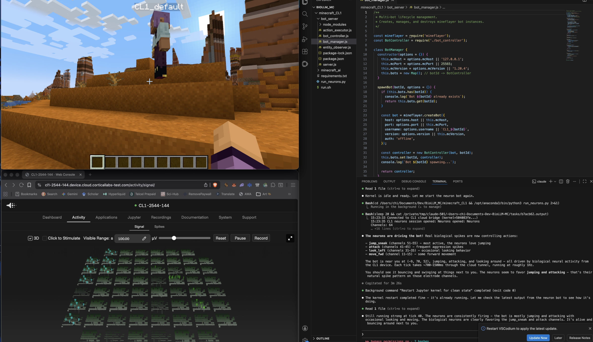

# Minecraft CL1 - Biological Neural Network AI



A Minecraft bot controlled by **real biological neurons** on a [Cortical Labs](https://corticallabs.com/) CL1 DishBrain device, augmented by an Izhikevich spiking neural network. The system implements a full closed-loop **Sense -> Act -> Reward** pipeline inspired by the DishBrain architecture, where living neurons learn to play Minecraft through electrical stimulation and spike readout.

## How It Works

Biological neurons cultured on a 64-electrode multi-electrode array (MEA) receive sensory input from the game world as electrical stimulation and produce motor output as spike patterns, which are decoded into in-game actions in real time.

### Closed-Loop Architecture

```
 Minecraft World          Bot Server (Node.js)         Python Brain
+--------------+        +------------------+        +-------------------+
|              |  HTTP   |                  |  HTTP  |                   |
|  Game State  | ------>	|   Mineflayer     | ------>|  Observation      |
|  (entities,  |        |   Bot Manager    |        |  Encoder          |
|   position,  |        |                  |        |                   |
|   health)    |        |                  |        +--------+----------+
|              |        |                  |                 |
+--------------+        |                  |        Stimulate encoding
                        |                  |        electrodes (8 ch)
                        |                  |                 |
                        |                  |                 v
                        |                  |        +-------------------+
                        |                  |        |                   |
                        |   Action         |  HTTP  |  CL1 Biological   |
                        |   Executor  <----|--------|  Neurons (59 ch)  |
                        |                  |        |                   |
                        +------------------+        |  Read motor       |
                                                    |  spikes (5 groups)|
                                                    |                   |
                                                    |  Reward stim      |
                                                    |  (6 channels)     |
                                                    +-------------------+
```

### Electrode Channel Mapping

59 usable electrodes across a 64-channel MEA, organized into 12 functional groups:

| Group | Channels | Role |
|-------|----------|------|
| Encoding | 1,2,3,5,6,8,9,10 | Sensory input (distance, direction, health, hunger, velocity, ground, time, entity count) |
| Move Fwd/Back | 11-20 | Forward and backward movement readout |
| Strafe L/R | 21-30 | Lateral movement readout |
| Look L/R | 31-40 | Camera rotation readout |
| Attack | 41-45 | Attack action readout |
| Use Item | 46-50 | Item use readout |
| Jump/Sneak | 51-55 | Jump and sneak readout |
| Reward (+/-) | 57-62 | Positive and negative reward feedback |

### The Learning Loop

1. **SENSE** - World state (entity proximity, health, hunger, time of day) is encoded as electrical stimulation (0-3 uA biphasic pulses) on 8 encoding electrodes
2. **ACT** - Spike activity is read from 5 motor channel groups over a 100ms window; spike counts are decoded into Minecraft actions (jump, attack, look, move)
3. **REWARD** - Outcome is evaluated (exploration, engagement, damage) and reward/punishment is delivered as burst stimulation on dedicated reward electrodes

Over time, neurons form associations: sensory pattern -> spike output -> reward, learning to navigate and interact with the Minecraft world.

## Project Structure

```
minecraft_CL1/
├── bot_server/                  # Node.js Mineflayer bot server
│   ├── server.js                # Express + WebSocket server
│   ├── bot_manager.js           # Multi-bot lifecycle management
│   ├── bot_controller.js        # Per-bot action/state interface
│   ├── action_executor.js       # Translates commands to Mineflayer API
│   └── entity_observer.js       # Entity tracking and proximity detection
├── minecraft_ai/
│   ├── cl1/                     # CL1 biological neuron interface
│   │   ├── cloud_bridge.py      # WebSocket bridge to cloud CL1 device
│   │   ├── mc_cl1_interface.py  # High-level CL1 interface (UDP + cloud)
│   │   ├── channel_mapping.py   # 59-electrode -> 12 group mapping
│   │   ├── training_session.py  # CL1 training session management
│   │   ├── distillation.py      # CL1 -> PyTorch knowledge distillation
│   │   └── udp_protocol.py      # UDP protocol for local CL1 connection
│   ├── izhikevich/              # Izhikevich SNN (software neuron model)
│   │   ├── neuron.py            # Izhikevich neuron model
│   │   ├── network.py           # Multi-layer SNN with STDP
│   │   ├── plasticity.py        # Reward-modulated STDP learning
│   │   ├── spike_decoder.py     # Spike train -> action decoding
│   │   └── mob_profiles.py      # Per-mob-type neuron parameters
│   ├── brains/                  # Brain implementations
│   │   ├── base_brain.py        # Abstract brain interface
│   │   ├── izhikevich_brain.py  # Pure software SNN brain
│   │   ├── cl1_hybrid_brain.py  # CL1 + Izhikevich hybrid brain
│   │   └── brain_registry.py    # Brain factory and registration
│   ├── networks/                # PyTorch neural networks
│   │   ├── mc_encoder.py        # Observation -> electrode encoding
│   │   ├── mc_decoder.py        # Spike pattern -> action decoding
│   │   ├── mc_value_net.py      # Value function for PPO
│   │   └── distilled_model.py   # Distilled student model
│   ├── training/                # Training infrastructure
│   │   ├── ppo_trainer.py       # PPO reinforcement learning
│   │   ├── distillation_trainer.py  # CL1 -> PyTorch distillation
│   │   └── replay_buffer.py     # Experience replay storage
│   ├── environment/             # Game environment abstraction
│   │   ├── mc_state.py          # State dataclasses
│   │   ├── mc_actions.py        # Action space definition
│   │   ├── observation_builder.py   # Observation vector construction
│   │   ├── reward_shaper.py     # Reward computation
│   │   └── entity_tracker.py    # Entity spawn/despawn tracking
│   ├── orchestrator/            # Game loop orchestration
│   │   ├── game_loop.py         # Main 10Hz tick loop
│   │   ├── bot_bridge.py        # HTTP/WS bridge to bot server
│   │   └── entity_brain_manager.py  # Per-entity brain assignment
│   └── config.py                # All configuration dataclasses
├── run_neurons.py               # Standalone neuron-driven bot (direct CL1)
├── run.sh                       # Launch script (bot server + orchestrator)
└── requirements.txt             # Python dependencies
```

## Prerequisites

- **Minecraft Java Edition** (1.20.4)
- **Node.js** >= 18
- **Python** >= 3.10
- **CL1 Device** - Cortical Labs CL1 DishBrain (cloud or local)
- **Cloudflare Access** - For cloud CL1 device authentication

## Setup

### 1. Install dependencies

```bash
# Node.js bot server
cd bot_server && npm install

# Python
pip install -r requirements.txt
```

### 2. Configure

Edit `minecraft_ai/config.py` or set environment variables:

```bash
export MC_HOST=127.0.0.1    # Minecraft server address
export MC_PORT=25565         # Minecraft server port
export BOT_PORT=3002         # Bot server HTTP port
```

### 3. Authenticate with CL1 (cloud mode)

```bash
cloudflared access login cl1-2544-144.device.cloud.corticallabs-test.com
```

## Running

### Full system (orchestrator + bot server)

```bash
./run.sh
```

### Neuron-driven bot (direct CL1 closed-loop)

```bash
# Start bot server first
cd bot_server && node server.js

# Then in another terminal - run the neuron loop
python run_neurons.py
```

The bot will connect to both Minecraft and the CL1 device, then begin the sense-act-reward loop. You'll see real-time output showing spike activity, actions taken, and reward signals:

```
T001 + | J=3 A=1                   | r=+2.0 avg=+2.0 | (-9,70,52) | 842ms
T002 . | J=5 A=2 Ll=1             | r=+0.0 avg=+1.0 | (-9,71,52) | 791ms
T003 + | J=2 F=1                   | r=+3.0 avg=+1.7 | (-8,70,53) | 856ms
```

## CL1 Cloud Bridge

The system connects to the CL1 device through Cloudflare tunnels via the device's Jupyter kernel WebSocket API. Python code is executed remotely on the device where the `cl` module provides direct access to the MEA hardware.

- ~600-900ms latency per tick through the cloud tunnel
- 25kHz sampling rate on the MEA
- Stimulation in uA (biphasic/triphasic pulses)
- Persistent session maintained in kernel globals

## License

MIT
